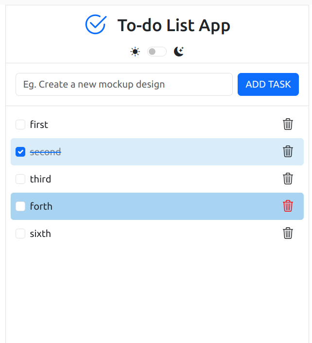
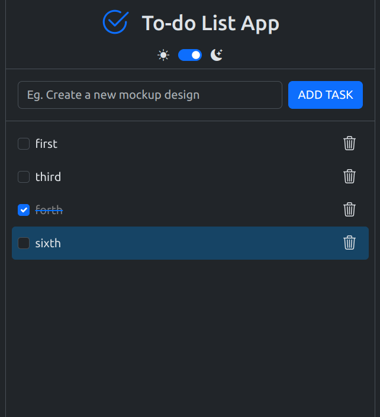

# To Do List App

## Description

This to-do list app leverages HTML, CSS (using Bootstrap), JavaScript, Vite for building, and Firebase for data storage. 
It offers the following features:

**Task Management:**  &nbsp; Add, edit, and delete tasks.

**Interactive Selection:** &nbsp;Mark tasks as completed using clicking or space bar key on keyboard.

**Navigation:**&nbsp; Up/Down arrow keys to move between tasks. Tab key for quick selection.

**Delete Items:**&nbsp; Delete items using the delete icon or the delete key on the keyboard.

**Theming:**&nbsp; Switch between light and dark themes for user preference.

**Firebase Integration:**&nbsp; Stores tasks in Firebase for persistence across sessions.

## Live Version
Check out the live version of the Todo List app [here](https://to-do-list-app-4b5d4.web.app).

## Technologies used

- **HTML:** Provides the basic structure and content of the web page.
- **CSS (with Bootstrap):** Styles the layout, appearance, and responsiveness of the app.
- **JavaScript:** Handles user interaction, logic, and dynamic behavior.
- **Vite:** A modern and performant build tool for JavaScript projects.

## Contributing
Contributions are welcome! Please open an issue or submit a pull request for any improvements or bug fixes.

## License
This project is licensed under the MIT License. See the [LICENSE](LICENSE.txt) file for details.

